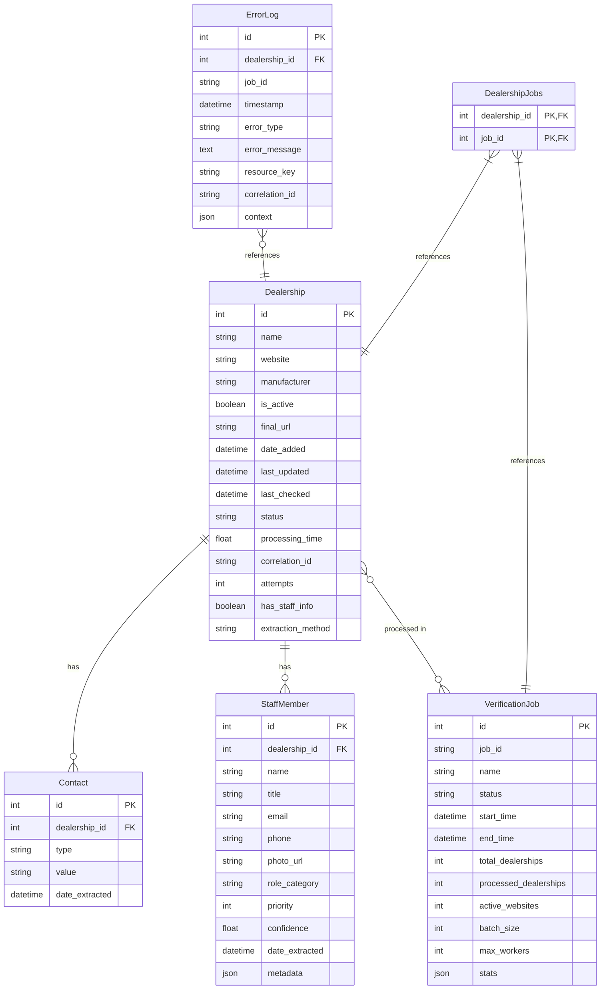

# Dealership Verification Database Schema

This diagram illustrates the database schema for the dealership verification system, showing the tables, their attributes, and relationships.

## Database Tables

### Dealership
Represents a car dealership with its basic information.
- **id**: Primary key
- **name**: Name of the dealership
- **website**: URL of the dealership's website
- **manufacturer**: Car manufacturer (e.g., Toyota, Honda)
- **is_active**: Whether the website is active
- **final_url**: Final URL after redirects
- **date_added**: When the dealership was added to the system
- **last_updated**: When the dealership was last updated
- **last_checked**: When the dealership was last verified
- **status**: Current status (pending, processing, completed, failed)
- **processing_time**: Time taken to process the dealership
- **correlation_id**: ID for tracking related operations
- **attempts**: Number of verification attempts
- **has_staff_info**: Whether staff information was extracted
- **extraction_method**: Method used for extraction (selenium, firecrawl, hybrid)

### Contact
Represents contact information for a dealership.
- **id**: Primary key
- **dealership_id**: Foreign key to Dealership
- **type**: Type of contact (email, phone, address)
- **value**: Contact value
- **date_extracted**: When the contact was extracted

### StaffMember
Represents staff members at a dealership.
- **id**: Primary key
- **dealership_id**: Foreign key to Dealership
- **name**: Name of the staff member
- **title**: Job title
- **email**: Email address
- **phone**: Phone number
- **photo_url**: URL to staff photo
- **role_category**: Category (management, sales, service, general)
- **priority**: Priority/importance ranking
- **confidence**: Confidence score for the extraction
- **date_extracted**: When the staff info was extracted
- **metadata**: Additional metadata as JSON

### VerificationJob
Represents a job for verifying multiple dealerships.
- **id**: Primary key
- **job_id**: Unique job identifier
- **name**: Job name
- **status**: Job status (pending, processing, completed, failed)
- **start_time**: When the job started
- **end_time**: When the job ended
- **total_dealerships**: Total number of dealerships to process
- **processed_dealerships**: Number of dealerships processed
- **active_websites**: Number of active websites found
- **batch_size**: Batch size for processing
- **max_workers**: Maximum number of worker threads
- **stats**: Job statistics as JSON

### ErrorLog
Represents errors that occurred during verification.
- **id**: Primary key
- **dealership_id**: Foreign key to Dealership
- **job_id**: ID of the related job
- **timestamp**: When the error occurred
- **error_type**: Type of error
- **error_message**: Error message
- **resource_key**: Resource that caused the error
- **correlation_id**: ID for tracking related operations
- **context**: Additional context as JSON

### DealershipJobs
Junction table for the many-to-many relationship between Dealership and VerificationJob.
- **dealership_id**: Foreign key to Dealership
- **job_id**: Foreign key to VerificationJob

## Relationships

- A **Dealership** can have many **Contacts** (one-to-many)
- A **Dealership** can have many **StaffMembers** (one-to-many)
- A **Dealership** can be part of many **VerificationJobs** (many-to-many)
- A **VerificationJob** can include many **Dealerships** (many-to-many)
- An **ErrorLog** can reference a **Dealership** (many-to-one)
