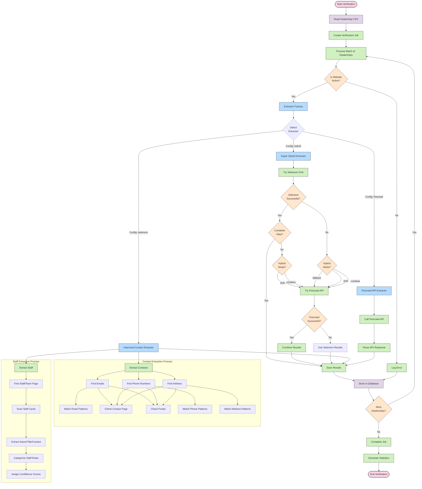

# Dealership Information Extraction Flow

This diagram illustrates the extraction process flow for gathering dealership information, showing how the different extractors work together.

## Extraction Process Overview

### 1. Job Initialization
- The system reads a CSV file containing dealership information
- A verification job is created to track progress
- Dealerships are processed in batches for efficiency

### 2. Website Verification
- For each dealership, the system first verifies if the website is active
- If the website is not active, an error is logged
- If active, the system proceeds to extract information

### 3. Extractor Selection
- The system uses a factory pattern to select the appropriate extractor based on configuration:
  - **Super Hybrid Extractor**: Combines multiple extraction methods
  - **Improved Contact Extractor**: Uses Selenium for extraction
  - **Firecrawl Extractor**: Uses the Firecrawl API

### 4. Super Hybrid Extraction Process
- **First Attempt**: Try Selenium-based extraction (faster, free, local)
  - Extract contact information (emails, phones, address)
  - Extract staff information when possible
  
- **Decision Point**: Based on results and configured mode:
  - **Auto Mode**: Use Firecrawl if Selenium missed important data
  - **Fallback Mode**: Only use Firecrawl if Selenium completely failed
  - **Combine Mode**: Always use both methods and combine results
  
- **Firecrawl API**: Used as a fallback or supplement
  - More reliable for difficult websites
  - Higher success rate but requires API calls
  
- **Results Combination**: Merge results from both methods when appropriate
  - Remove duplicates
  - Prioritize more complete information

### 5. Contact Extraction Process
- Find emails using pattern matching and targeted page scanning
- Find phone numbers using pattern matching and targeted page scanning
- Find address information from contact pages and footers

### 6. Staff Extraction Process
- Locate staff/team pages on the dealership website
- Scan staff cards or listings for information
- Extract name, title, and contact information
- Categorize staff by role (management, sales, service)
- Assign confidence scores to extracted information

### 7. Data Storage
- Store extracted information in the database
- Update job progress and statistics
- Generate reports for completed jobs

## Extraction Modes

The system supports three extraction modes:

1. **Auto Mode**: Intelligently decides when to use Firecrawl based on Selenium results
2. **Fallback Mode**: Only uses Firecrawl when Selenium completely fails
3. **Combine Mode**: Always uses both methods for maximum data coverage

This flexible approach balances:
- Speed (Selenium is typically faster when it works)
- Quality (improved extraction techniques)
- Reliability (Firecrawl has higher success rates)
- Cost-effectiveness (only use API calls when needed)
